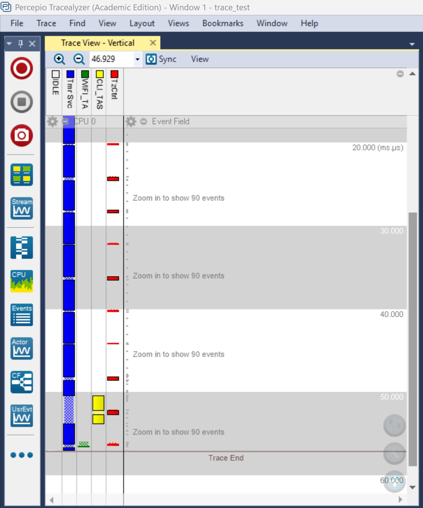
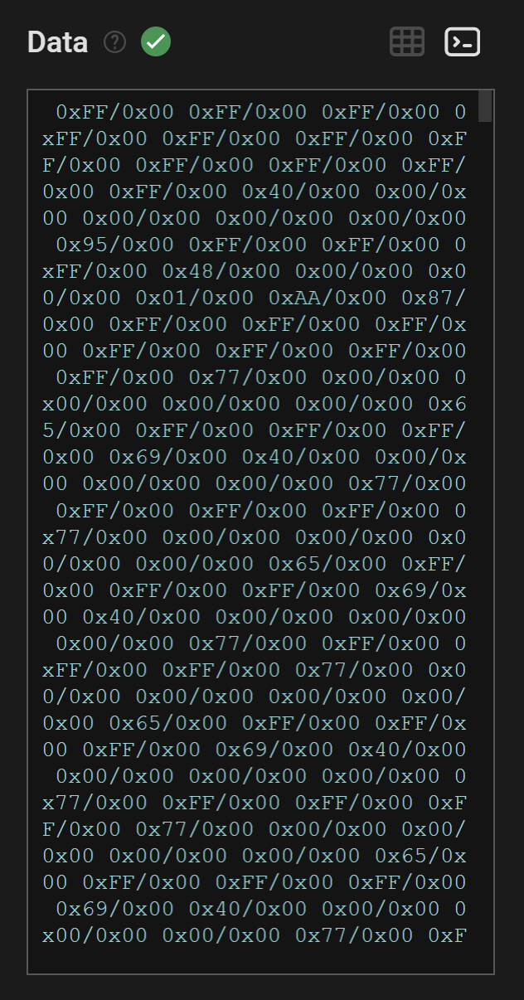
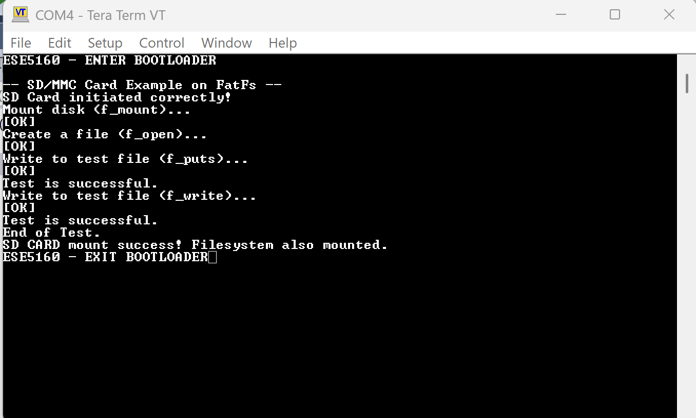
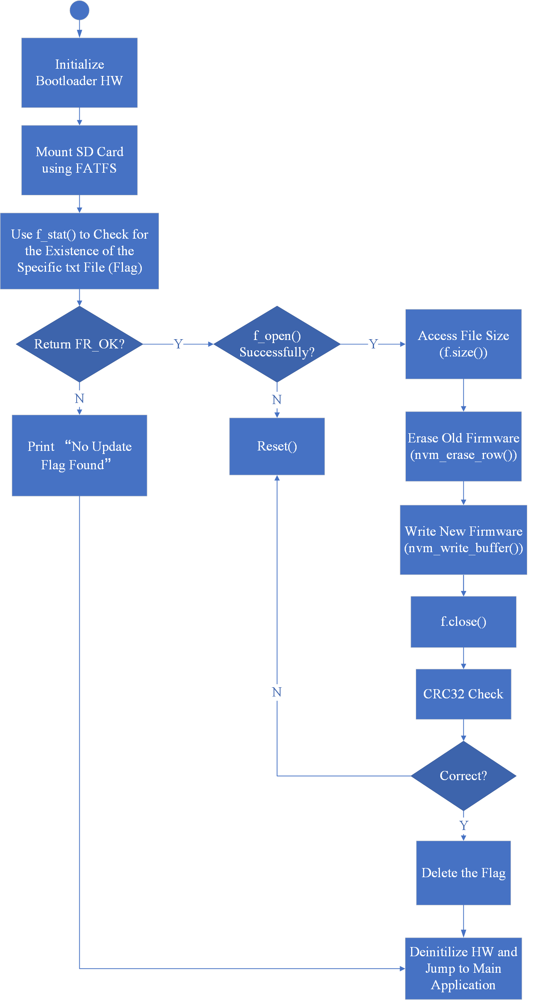

# a08g-the-bootloader-waltz

* Team Number: T06
* Team Name: Byte Crafter
* Team Members: Tony Yan & Yue Zhang
* GitHub Repository URL: https://github.com/ese5160/final-project-t06-byte-crafter
* Description of test hardware: ROG Zephyrus G14, HUAWEI 14

## 1. Using Percepio

Here is the screenshot of our Percepio trace:  

## 2. Capture SD Card Comms

### 2.1 photo of hardware connections

This is the hardware connection between the SAMW25 Xplained dev board, the SD card module, and the logic analyzer:  

### 2.2 screenshot of the decoded message and capture file of the SD card communication

1. This is the screenshot of the decoded message: 
2. This is the capture file of the SD card communication: 

## 3. Bootloader Design

### 3.1 describing how bootloader will work

The bootloader starts by initializing the hardware and mounting the SD card using FATFS. It then checks for the presence of a specific update flag file using f_stat(). If the file is not found, the bootloader prints "No Update Flag Found" and jumps to the main application.

If the update flag is found, the bootloader opens the firmware file using f_open() and checks for successful access. It then retrieves the file size using f_size() and erases the old firmware from the MCU's flash memory using nvm_erase_row(). The new firmware is written to flash in chunks using nvm_write_buffer().

After the write operation is complete, the bootloader performs a CRC32 check to verify the integrity of the newly written firmware. If the calculated CRC matches the expected value, the update is considered successful. The bootloader then deletes the update flag file, deinitializes the hardware, and jumps to the main application.

### 3.2 flow chart of bootloader implementation

Bootloader Flowchart:  

## 4. Bootloader Implementation

Done, all source code is under Bootloader folder.

## 5. CRC checks

### 5.1 well-commented firmware to the GitHub classroom assignment

Done, all source code is under Bootloader folder.

### 5.2 video of firmware switching when pressing the SWO button

Here is the link to the demo video: [demo_video](https://drive.google.com/file/d/14KFV6SlA-HbOaJaKSZXBG05Z4El8GV7G/view?usp=drive_link)
