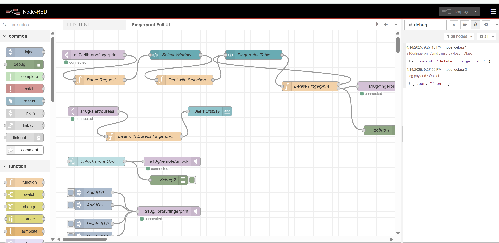
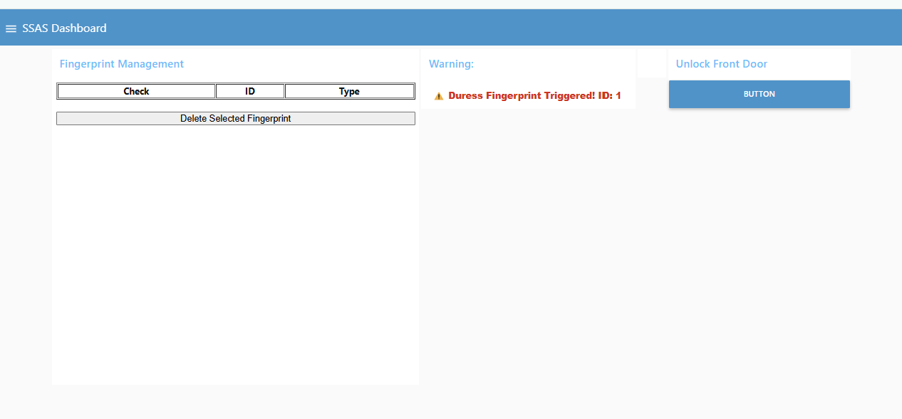
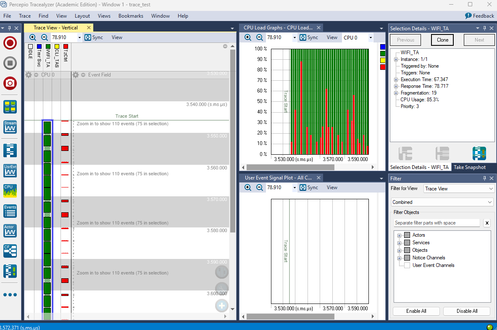

# a10g-cloud

* Team Number: T06
* Team Name: Byte Crafter
* Team Members: Tony Yan & Yue Zhang
* GitHub Repository URL: https://github.com/ese5160/final-project-t06-byte-crafter
* Description of test hardware: ROG Zephyrus G14, HUAWEI 14

## 1. OTAFU

1. [fw_CLI](https://drive.google.com/file/d/1AkIwNU6J5DHiIGCX_sEbTWcL2S3Hj_37/view?usp=sharing)

2. Done, codes are under Bootloader and Application files.

## 2. Golden Image

1. [CRC_Correct](https://drive.google.com/file/d/1oC8NIgpK6hW3kwf3ayY1jSHdP63nI2TL/view?usp=sharing)

2. [CRC_Incorrect](https://drive.google.com/file/d/1fnJjOP-l3CE4UHcpJJ2hPr719Hdra46C/view?usp=sharing)

3. Done, codes are under Bootloader and Application files.

## 3. Node-RED Design

### 3.1 General Program Flow between Device and Cloud

Our system integrates a fingerprint scanner and a motor-controlled door to manage both physical access and secure interaction with the LCD display. The system communicates with the cloud to make access decisions based on fingerprint identity and door state.

1. Fingerprint Scanning Triggered:  
When a user places their finger on the fingerprint scanner, the system captures the fingerprint ID. Simultaneously, it checks the current state of the door (open or closed). Both the fingerprint ID and the door state are sent to the cloud.

2. Cloud Processing:
   1. The cloud uses the fingerprint ID to:
      1. Determine whether it is a registered normal fingerprint or a registered duress fingerprint.
      2. Use the accompanying door state to help infer the user's intention if the fingerprint is normal.

3. Cloud Response:
   1. If it is a duress fingerprint:
      1. The cloud immediately issues an alarm, regardless of whether the door is open or closed.
   2. If it is a normal fingerprint:
      1. If the door is open, the cloud assumes the user wants to access the LCD display, and sends back permission to proceed.
      2. If the door is closed, the cloud assumes the user intends to unlock the door, and sends back permission to open it.

### 3.2 List all the Topics System will Use

| **Topic Name**              | **Direction**          | **Payload Format**       | **Description** |
|-----------------------------|------------------------|--------------------------|------------------|
| `a10g/library/fingerprint`  | Device → Cloud         | `{   "request": string,   "finger_id": int }`  | After selection in LCD, a signal (add/delete) sent to Cloud |
| `a10g/alert/duress`         | Device → Cloud         | `{ "duress": bool }`             | Signal from Fingerprint module to Cloud when a duress fingerprint is detected
| `a10g/remote/unlock`        | Cloud → Device         | `true`                   | Simple signal to trigger door unlock remotely. |

### 3.3 Describe for Each Topic

| **Topic Name**               | **Published By**         | **Subscribed By**             |
|----------------------------- |--------------------------|-------------------------------|
| `a10g/library/fingerprint`   | Device (MCU)             | Cloud (Node-RED)              |
| `a10g/alert/duress`          | Device (MCU)             | Cloud (Node-RED)              |
| `a10g/remote/unlock`         | Cloud (Node-RED)         | Device (MCU)                  |

### 3.4 Divide MCU Application Code into Threads

**Thread Responsibilities:**

| Thread Name           | Responsibility                                                                 |
|-----------------------|--------------------------------------------------------------------------------|
| `FingerprintThread`   | Scans fingerprint and sends result (`finger_id`, duress signal, etc.) to `MQTTClientThread`. |
| `MQTTClientThread`    | Handles MQTT communication. Publishes fingerprint data, duress alerts, register/delete signals; receives remote unlock command from cloud. |
| `AccessControlThread` | Executes unlock or LCD commands, including remote unlock triggered by cloud. |
| `RegistrationThread`  | Handles fingerprint enrollment and deletion triggered via LCD selection. |

**Inter-Thread Communication:**

| From                | To                    | Data/Trigger                                                     | Method             |
|---------------------|------------------------|------------------------------------------------------------------|--------------------|
| `FingerprintThread` | `MQTTClientThread`     | `{ "finger_id": int }`, `{ "duress": bool }`                     | Queue              |
| `MQTTClientThread`  | `AccessControlThread`  | `true` (remote unlock signal)                                    | Flag / Queue       |
| `AccessControlThread` | `RegistrationThread` | `{ "register_delete": string }` ("register" or "delete")         | Queue or flag      |
| `RegistrationThread` | `MQTTClientThread`     | `{ "finger_id": int }` (send to cloud for updating fingerprint library) | Queue        |

## 4. Bidirectional Cloud Communication

1. [Bidirectional_Cloud_Communication_Video](https://drive.google.com/file/d/1v-Nby18BvzXBgqDTXp8fBck5pqPXnUZp/view?usp=sharing)

2. [Node-RED Source Code](/Node-RED/flows.json)

3. [Node-RED UI](http:104.211.2.174:1880/ui)

4. Done, code is in WifiHandler.c

## 5. Node-RED Implementation

1. [Node-RED_demo](https://drive.google.com/file/d/1uBQdyJtHi-jTCxJdanfXTe5G0t1WATRe/view?usp=drive_link)
2. Here id screenshot of backend and frontend of Node-RED.
   1. Backend: 
   2. Frontend: 
3. Done, it's in Node-RED folder, named SSAS.json
4. Here is the link to our Node_RED UI: [Node_RED](http://104.211.2.174:1880/ui)

## 6. Percepio Analysis

1. Here is the wifi task cpu usage:  

2. Describe insights from reviewing the Percepio Tracelyzer analysis
   1. How much CPU is used by the WiFi task?
   From the CPU Load Graph in Tracealyzer, the WiFi task uses 85% of the CPU. This is shown by the consistent green bars dominating most of the columns.
   2. How long is the CPU in the idle task?
   The idle task is not shown in this particular trace, which suggests that the CPU is nearly always active. Given that WiFi, CLI, and Timer tasks consume nearly 100% combined, the idle task likely gets very little time, probably less than 5%, or even 0% during peak load.
   3. How will you plan your application tasks so that you don’t go over 100% utilization?
      1. Prioritize critical tasks by assigning them higher priorities.
      2. Keep low-priority tasks efficient and non-blocking.
      3. Use delays or blocking queues in tasks to yield the CPU when inactive.
