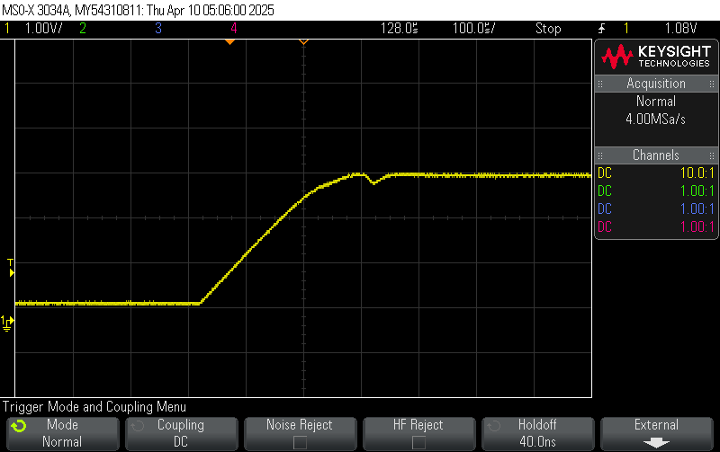
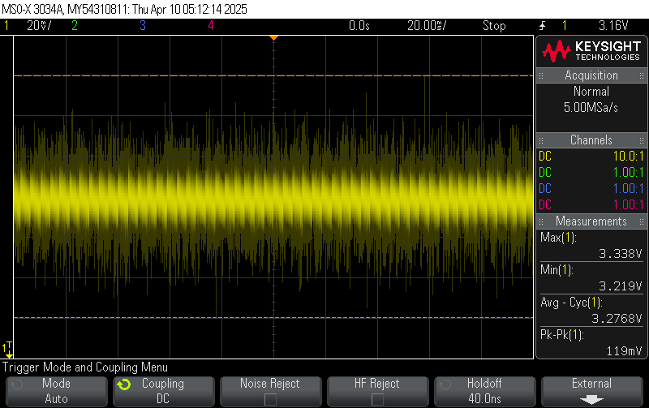
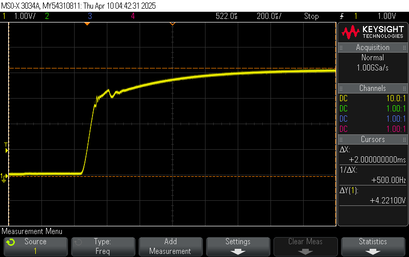
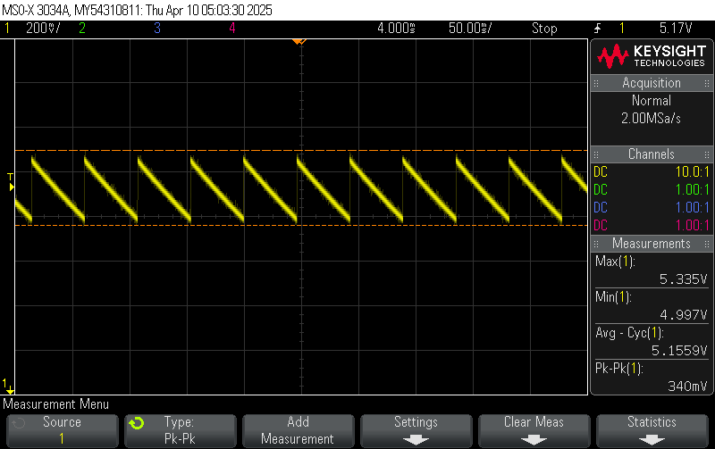
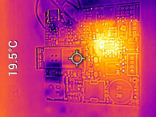
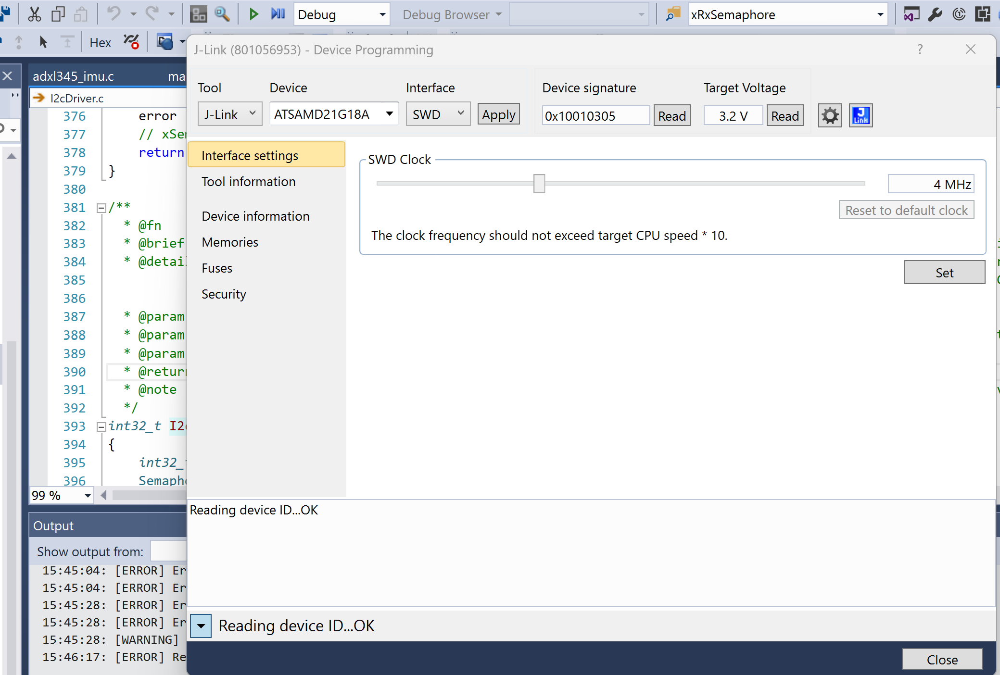

# a11g-board-bringup

* Team Number: T06
* Team Name: Byte Crafter
* Team Members: Tony Yan & Yue Zhang
* GitHub Repository URL: https://github.com/ese5160/final-project-t06-byte-crafter
* Description of test hardware: ROG Zephyrus G14, HUAWEI 14

## 1. Visual Board Inspection & Photograph

### 1.1 List any issues uncovered in optical inspection

There is no any issues uncovered in optical inspection.

### 1.2 Submit at least three light box photos of your PCBA

Please see below PCBA photos:  

## 2. Power System Evaluation

### 2.1 Distinct Power Modes

Our device has two power sources: single cell LiPo and USB power. It has two regulators: a 3.3V buck and a 5V boost. My distinct power modes would be:

1. Unregulated battery only is connected and ranges from 3.30V to 4.20V.
2. Regulated USB only is connected and ranges from 4.85V to 5.25V.
3. Both battery and USB are connected, so the USB voltage will be preferred (4.85-5.25V).

### 2.2 Power Regulation Evaluation

1. Submit photos of your PCBA soldered with voltage test wires:  

2. Submit your labeled oscilloscope captures and voltage calculations:  
   1. 3v_startup.png:
   2. 3v_steady.png:
   3. 5v_startup.png:
   4. 5v_steady.png:
3. Do a brief write-up with your results
   1. The regulated 3.3V output from the buck converter was analyzed under steady-state conditions using an oscilloscope. The following key parameters were measured:  

    | Parameter              | Measured Value  |
    |------------------------|-----------------|
    | **Average Voltage**    | 3.276 V         |
    | **Maximum Voltage**    | 3.338 V         |
    | **Minimum Voltage**    | 3.219 V         |
    | **Ripple (Pk-Pk)**     | 119 mV          |
    | **Ripple % of Vout**   | ≈ **3.63%**     |

   2. The regulated 5V output from the buck converter was analyzed under steady-state conditions using an oscilloscope. The following key parameters were measured:  

    | Parameter              | Measured Value  |
    |------------------------|-----------------|
    | **Average Voltage**    | 5.155 V         |
    | **Maximum Voltage**    | 5.335 V         |
    | **Minimum Voltage**    | 4.997 V         |
    | **Ripple (Pk-Pk)**     | 340 mV          |
    | **Ripple % of Vout**   | ≈ **6.60%**     |

In conclusion, everything within specification.

### 2.3 Load Testing

1. Photos of E-Load testing setup  

2. A table of expected load with the corresponding voltage as measured by the E-Load  

| Load % | Current (mA) | Output Voltage (V)  |
|--------|--------------|---------------------|
| 10%    | 100          | 5.05                |
| 50%    | 500          | 4.97                |
| 100%   | 1000         | 4.94                |
| 120%   | 1200         | 4.93                |

3. List any issues encountered  
Not really have any issues during test.

4. Analyze your results: what do you take away from these readings  
From the load testing results, I observed that the output voltage began to drop significantly when the current draw approached the expected maximum load. This indicates that the regulator or power source may not be capable of maintaining a stable output under high load conditions. The sudden voltage collapse at higher currents suggests either a current limit was reached, or the regulator entered protection mode. The takeaway is that power components must be carefully selected and tested under worst-case conditions to ensure system reliability.

### 2.4 Thermal Image

1. Submit a thermal image of your device running under load  

2. Write what load the PCBA circuit was running under  
The image was captured while the 5V power rail on the PCBA was under a 1.2A constant current load applied by the electronic load.

## 3. Programming

### 3.1 Submit a photo of your programmer attached to the PCBA

### 3.2 Submit a screenshot of your device signature and target voltage from the device programming window

### 3.3

Didn't get any issues.

## 4. Peripheral Evaluation

### 4.1 Submit videos / GIFs of your peripherals working on your PCBA

1. Debug LED: [debug_LED](https://drive.google.com/file/d/1UypzOzzIQpMQeW5kbZ6oN14ip_G_ZvD8/view?usp=drive_link)
2. Debug Button: [debug_button](https://drive.google.com/file/d/1Mxt_yujvpV8f2Mj9pkXgU-txoSJIhMoB/view?usp=drive_link)
3. UART Communication: [UART_communication](https://drive.google.com/file/d/1FmZcgt86Mc7GPZROUGG6RUGilZ8QFKyJ/view?usp=drive_link)
4. Non-volatile Memory (SD Card): 
5. I2C Device: [I2C_device](https://drive.google.com/file/d/1PYLPo5pfAXS1OL1rAU4TqK_AiPrdUUKx/view?usp=drive_link)

### 4.2 List any issues encountered

Didn't really encountered any issues during the testing.
