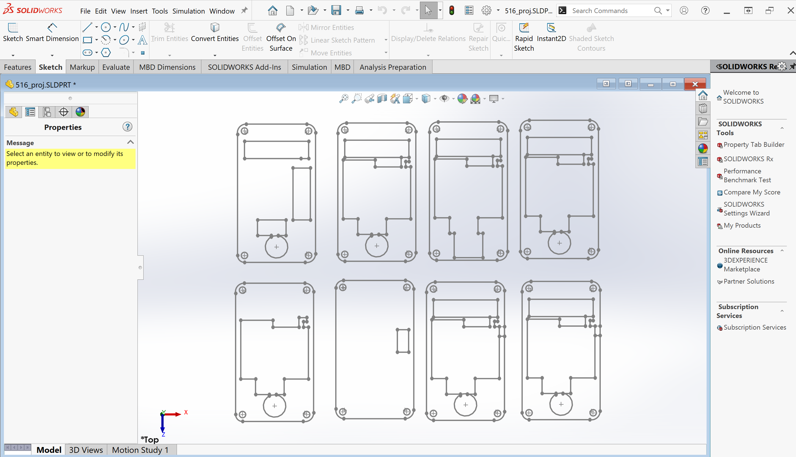
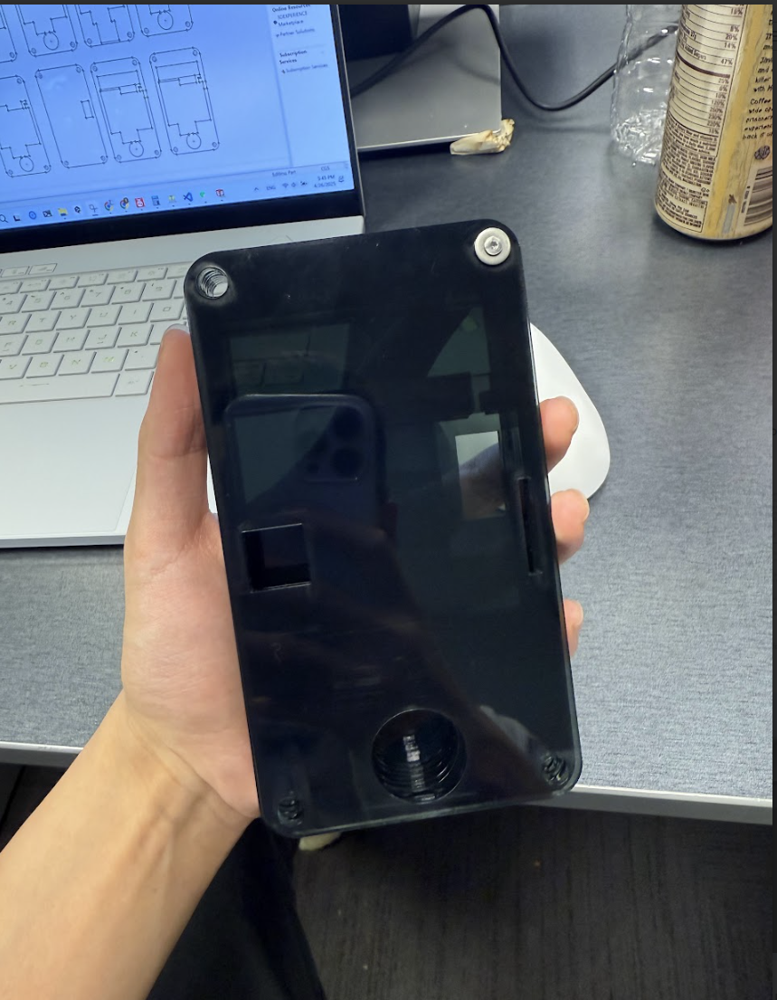

# ec01g-MCAD-model

* Team Number: T06
* Team Name: Byte Crafter
* Team Members: Tony Yan & Yue Zhang
* GitHub Repository URL: https://github.com/ese5160/final-project-t06-byte-crafter
* Description of test hardware: ROG Zephyrus G14, HUAWEI 14

## 1.  MCAD Model

### 1.1 Commit your MCAD model to the GitHub repository

Here is the github link of our solidpworks file: [516_proj.SLDPRt](https://github.com/ese5160/final-project-t06-byte-crafter/blob/main/516_proj.SLDPRT)

### 1.2 Build a prototype of this model

Done.

### 1.3 Submit a PDF containing

1. This is the screenshot of our model: 
2. This is the photograph of your constructed design in the physical world: 
